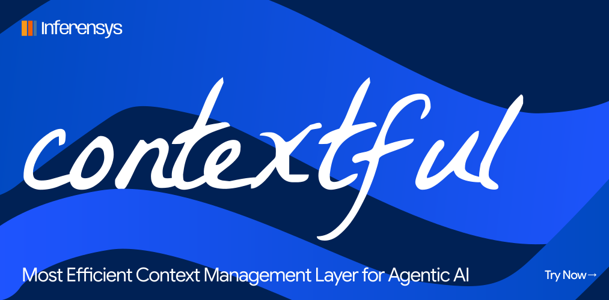
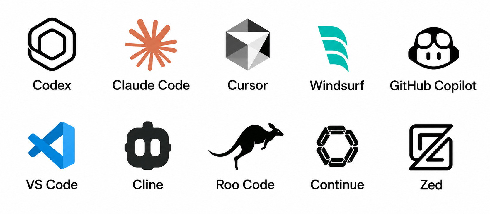
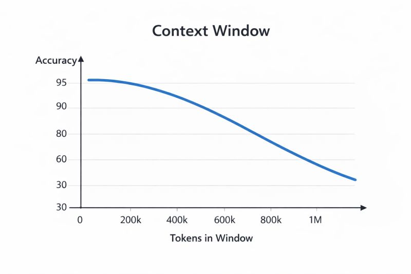
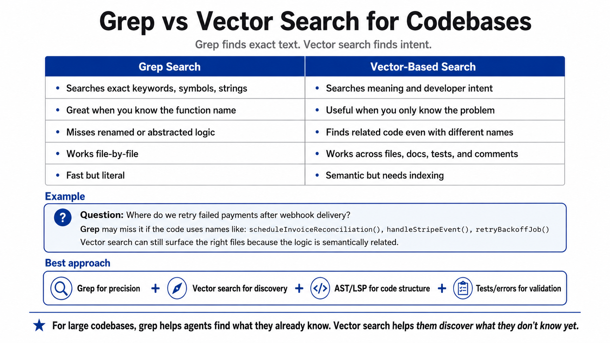

# *Contextful*

**Local Context Management + Search Engine + Memory for Agentic AI.**

Contextful is a runtime contextual layer and local search engine for agents that gives them one fast way to find, compress, cite, and remember project context.

Available as a CLI-first tool with an MCP runtime bridge and generated agent instructions, it integrates seamlessly with Codex, Claude Code, Cursor, Windsurf, GitHub Copilot, VS Code, Cline, Roo Code, Continue, and Zed.




Instead of making an agent read 40 files every session, Contextful indexes the project once and returns a ranked, cited, token-budgeted **context pack**.

## Why?

Context has always been a bottleneck for agentic AI. Large context window models (for example, 1M tokens) are:
1. Expensive and require significantly more compute & processing time.
2. More likely to lose key information as the context window fills up.
3. Most projects have millions of lines of code, but agents can only fit in limited tokens per context window.

The current solution is to make the agent guess which files to read, then pay the token cost to read them every session. This is slow, expensive, and lossy.

Apart from this, agents have no way to store or share learnings across sessions. Every time they start, they forget everything and have to re-read the same context again.



I started developing Contextful to keep the context window smaller by enabling efficient knowledge retrieval. If we index the project and return a ranked, cited, token-budgeted context pack, we can:
- **100x more efficient token usage:** stop paying tokens to re-read the same files.
- **Fewer tool calls:** one context pack can replace dozens of grep, glob, and read-file calls.
- **No lost context between sessions:** agents can store session learnings in an evidence-backed memory ledger.
- **Shareable project knowledge:** lessons and context packs survive context compaction and future sessions.

## Key Features

### 1. Context Management

The default local store is SQLite with FTS-backed search and typed graph tables. V1 ships with:

- SQLite as the default local store.
- FTS5 lexical/BM25 search.
- Typed graph tables: `nodes`, `edges`, `node_props`, `edge_props`.
- A hot adjacency cache for common graph relations.
- Deterministic structural fingerprints inspired by Code2Vec-style secondary reranking signals.

The next storage upgrades are optional semantic vectors through sqlite-vec, LanceDB, or local HNSW, and compressed adjacency lists with Roaring bitmaps or CSR arrays for larger repositories.


### 2. Search Engine



Contextful analyzes the query, classifies intent, and combines lexical search, symbols, docs, graph relationships, and memory hits to retrieve the right evidence. The goal is Google-level project search for agents: vague queries like "resources for auth onboarding" should still land on the right code, docs, and prior lessons.


### 3. Memory Ledger

Agents can store lessons, decisions, and useful project facts, but not as loose "remember this" notes. Every memory requires evidence refs from files, symbols, commits, or prior context packs. When the evidence changes, Contextful marks the memory stale.

### 4. Contextful Execution

Contextful is an MCP server, local indexer, and small CLI:

- **MCP server:** the agent interface.
- **Local daemon / watcher:** indexing, rebuilds, freshness, and future benchmarks.
- **CLI (`cxf`):** human setup, indexing, search, memory writes, and local smoke tests.

MCP is the right interface because tools, resources, and prompts are exactly what MCP standardizes. The agent asks for context; Contextful returns compact evidence.

## Install

```bash
npx @inferensys/contextful init --workspace .
npx @inferensys/contextful search "where is user auth handled" --workspace . --budget 2000
```

Run as an MCP server:

```bash
npx @inferensys/contextful server
```

## CLI

The primary binary is `cxf`; `contextful` is also provided as a readable alias.

```bash
cxf init --workspace <path>
cxf index --workspace <path> [--watch]
cxf daemon --workspace <path>
cxf search "<query>" --workspace <path> --budget 2000 --json
cxf memory add --workspace <path> --claim <text> --evidence <ref>
cxf server
```

## Core MCP Tools

Keep the agent surface small:

- `context_pack(query, budget, scope)` - the killer tool. Returns a ranked, cited, token-budgeted bundle instead of forcing 40 random file reads.
- `search_code(query, mode, filters)` - powerful code, docs, symbol, and memory search.
- `trace_path(from, to, edge_types)` - graph traversal across files, symbols, modules, and config.
- `impact_analysis(symbol_or_file)` - reverse dependencies and likely tests.
- `why_changed(symbol_or_file)` - current evidence plus git history.
- `recall_memory(query, scope)` - search session learnings and durable project lessons.
- `write_lesson(claim, evidence_refs, scope)` - store an evidence-backed memory.

## MCP Client Setup

Use this stdio server command in any MCP-aware coding tool:

```json
{
  "mcpServers": {
    "contextful": {
      "command": "npx",
      "args": ["-y", "@inferensys/contextful", "server"]
    }
  }
}
```

Codex:

```bash
codex mcp add contextful -- npx -y @inferensys/contextful server
```

## CLI-First Agent Flow

Use `cxf init` once per workspace. It indexes the project and writes `.contextful/AGENT_INSTRUCTIONS.md`, a compact skill-style guide that tells agents when to call `context_pack`, when to search more narrowly, and when memory writes are allowed.

Use `cxf search` when a human wants to test the same evidence pack an agent will receive:

```bash
cxf search "how does auth load user profiles?" --workspace . --budget 2000
```

The MCP server remains the agent interface. The CLI is for setup, inspection, and repeatable local tests.

## Privacy

V1 is local-only. It does not call external embedding APIs, upload source code, edit source files, auto-fix code, or install dependencies inside the target workspace.

## Evidence Refs

Memory writes require evidence references returned by search or context packs:

- `file:src/auth.ts:10-40`
- `symbol:src/auth.ts#AuthService:12`
- `pack:ctx_...`

Invalid or stale evidence is rejected or marked stale.
